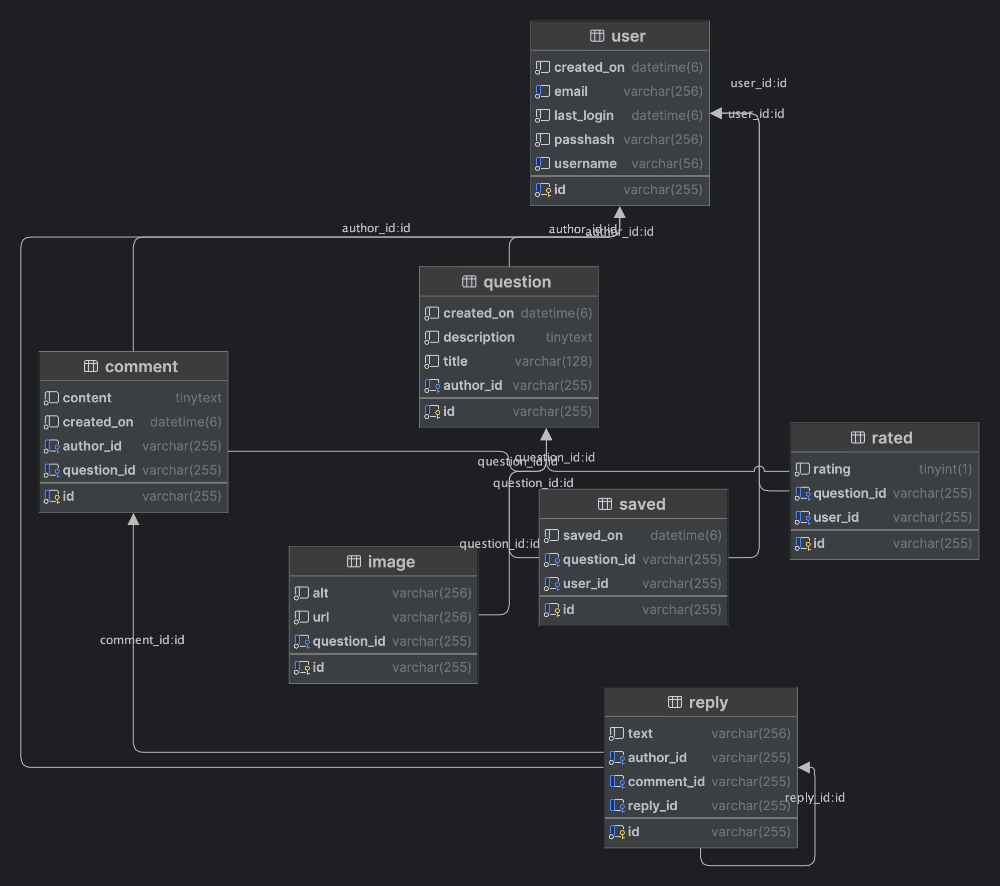

# Snackoverflow
School project for the course "OOP with Java" at TUES 

## Project description
Snackoverflow is a simple REST API for a stackoverflow-like website

[//]: # (TODO: Finish project description)

## Project structure 

[//]: # (TODO: Add project structure)

## Database structure

## API endpoints

[//]: # (TODO: Add API endpoints)

## How to run the project

[//]: # (TODO: Add instructions for running the project)